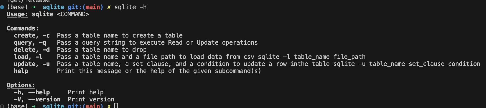
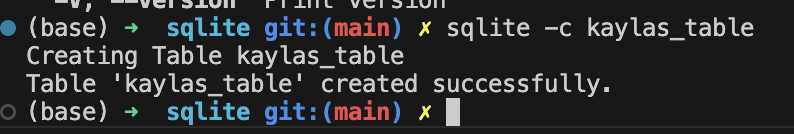
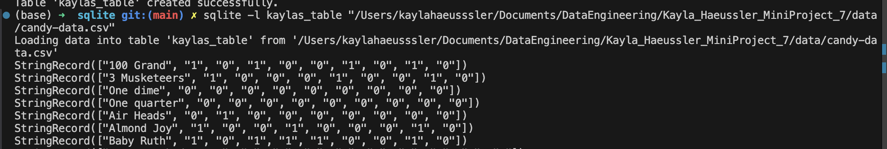
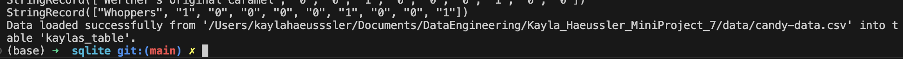
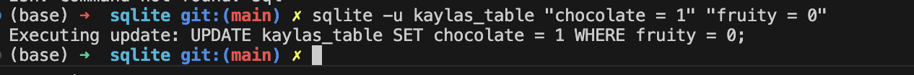
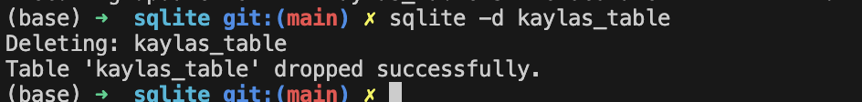

# Kayla_Haeussler_IndividualProject2

IDS 706: Individual Project 2  
Rust CLI Binary with SQLite  
Kayla Haeussler  

[](https://github.com/nogibjj/Kayla_Haeussler_IndividualProject2/actions/workflows/CI.yml)  

Video overview: https://youtu.be/273KRvnfFPE

## Project Requirements
* Rust source code: The code should comprehensively understand Rust's syntax and unique features.
* Use of Github Copilot (Use of other LLMs): In your README, explain how you utilized Github Copilot or other LLM models in your coding process.
* SQLite Database: Include a SQLite database and demonstrate CRUD (Create, Read, Update, Delete) operations.
* Optimized Rust Binary: Include a process that generates an optimized Rust binary as a Gitlab Actions artifact that can be downloaded.
* README.md: A file that clearly explains what the project does, its dependencies, how to run the program, and how Gitlab Copilot was used.
* Github/Gitlab Actions: A workflow file that tests, builds, and lints your Rust code.
* Video Demo: A YouTube link in README.md showing a clear, concise walkthrough and demonstration of your CLI binary.


The purpose of this project was to perform ETL (extract, transform load) and CRUD (create, read, update, delete) of a SQLite database using Rust. The data set I used in this project is the candy-data.csv dataset I have used in previous assignments, originally taken from the ```fivethirtyeight``` repository 

## Utilization of LLM Aid
I ChatGPT to aid with syntax issues with Rust, as it is a language a I do not have a lot of experience with. Specifically, I used ChatGPT to translate a previous project where I used Python to Rust.

## Installing and Using this Tool
First, ensure your rust environment is already set up.   
Optimized Rust Binary: https://github.com/nogibjj/Kayla_Haeussler_IndividualProject2/actions/runs/11670284906/artifacts/2142603898  

### clap, rusplite and csv
Run the following in your terminal, this will make changes to the Cargo.toml file. 
* cargo add clap --features derive
* cargo add rusqlite
* cargo add csv

### Using this tool
In the lib.rs file I have created functions that will execute Create, Read, Update and Delete functionality of SQL queries, from the command line. These queries can be run from the command line using the following commands: 


We need to establish the projects release folder by running an export PATH command, adapted to your individual file paths. On my machine it looks like this:  
``` export PATH=$PATH:/Users/kaylahaeusssler/Documents/DataEngineering/Kayla_Haeussler_IndividualProject2/sqlite/target/release```
### Create

### Load


### Update

### Delete
